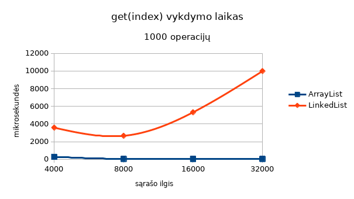
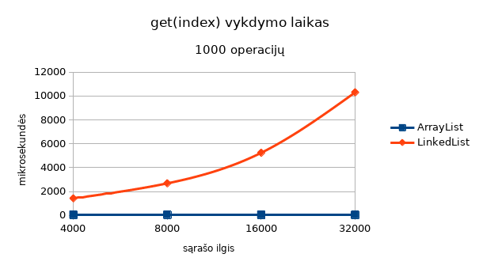
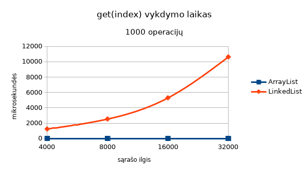

# Duomenų struktūrų greitaveikos tyrimas

Tinkamų duomenų stuktūrų parinkimas leidžia kuriamose programose efektyviau
panaudoti turimus kompiuterinius resursus. Pagrindinės duomenų struktūrų
charakteristikos, įtakojančios jų tinkamumą tam tikram projektui, yra įvairių
operacijų su nagrinėjama duomenų struktūra atlikimo *greitis* ir struktūros
naudojamas *atminties kiekis*. Šiame dokumente aptarsime, kokios problemos
iškyla bandant įvertinti *Java* parašyto programinio kodo greitaveiką,
ir apžvelgsime galimus tų problemų sprendimo būdus.

Tarkime, kad programoje reikalingas dinamiškas vienmatis (ir potecialiai
didelis) vienodo tipo elementų sąrašas, ir svarbu, jog kiekvienas elementas
pagal jo numerį, t.y. indeksą, būtų pasiekiamas kuo greičiau. Java platformos
standartinėje bibliotekoje tam galima panaudoti `java.util.ArrayList` arba
`java.util.LinkedList` klases. Abi jos realizuoja metodą `get(int index)`,
kurio veikimo greitis šiose klasėse mus ir domina.

## Paprastas greitaveikos testas

Klasėje `edu.ktu.ds.benchmark.SimpleBenchmark` pateikta paprasčiausia realizacija
greitaveikos testo, kuris pamatuoja, kiek laiko užtrunka įvykdyti `ArrayList.get()'
ir `LinmkedList.get()` metodus - t.y., kuris iš jų greitesnis. Joje reikėtų atkreipti
dėmesi į kelis aspektus:

* Siekiant sumažinti laiko matavimo paklaidų įtaką, dominanti operacija, kaip
šiuo atveju tiriamas `get()` metodas, atliekama daug (pvz. 1000) kartų.
* Metodas testuojamas su atsitiktiniais indeksais, pagal kuriuos iš sąrašo paimami
elementai. Tai leidžia gauti bendresnius tyrimo rezultatus. Patys sąrašai taip
pat užpildomi atsitiktinėmis reikšmėmis, bet tai šiuo atveju nėra svarbu, nes 
`get()` metodo greitis neturėtų priklausyti nuo to, kokie duomenys saugomi sąraše.
* Iš kodo, kurio vykdymo laikas matuojamas, pašalinama kuo daugiau pagalbinių
operacijų, nes jos gali iškreipti testo rezultatus. Šiuo atveju tai yra atsitiktinių
indeksų generavimas - net jei jie nebūtų pakartotinai panaudojami abiems tiriamiems
sąrašams, vis tiek reikėtų juos sugeneruoti prieš atliekant matavimus. Generuojant
indeksus "gyvai" (`list.get(generator.nextInt())`), didelė dalis pamatuoto laiko
(šiuo atveju - apie pusę) būtų skirta atsitiktinių skaičių generavimui ir su pačia
`get()` operacija nieko bendro neturėtų.
* Metodo `get()` greitis matuojamas su keliais skirtingais sąrašų dydžiais. Taip
daroma todėl, kad teorinės žinios apie tiriamų duomenų struktūrų veikimą leidžia
tikėtis, jog metodo vykdymo laikas priklausys nuo sąrašo dydžio (bent jau
`LinkedList` atveju). Jei, kaip šiuo atveju, tikslus būsimo sąrašo dydis iš
anksto nėra žinomas, šie dydžiai parenkami laisvai, siekiant ištikri, kaip kinta
metodo vykdymo laikas ilgėjant sąrašui.

Deja, įvykdžius šią programą, gaunami sunkiai paaiškinami rezultatai - padidinus
sąrašų dydį nuo 4000 iki 8000, metodo vykdymo laikas ne pailgėja, o sutrumpėja:

|       | ArrayList, us | LinkedList, us |
|------:|--------------:|---------------:|
|  4000 |       276.495 |       3582.875 |
|  8000 |        42.795 |       2661.929 |
| 16000	|        40.154 |       5321.878 |
| 32000 |        43.965 |       9986.685 |

## Patobulintas greitaveikos testas

Galima pastebėti, kad bendrame paprasto greitaveikos testo rezultatų fone išsiskiria
laikas, gautas matavimų pradžioje (su 4000 elementų sąrašais). Testo pradžioje
skaičiavimai atliekami lėčiau. Rezultatai, gauti su 8000, 16000 ir 32000 elementų
sąrašais yra nuoseklūs ir pagrįsti duomenų strukūtų teorija: `ArrayList` elemento
gavimas pagal indeksą turėtų būti pastovus ir nepriklausyti nuo sąrašo ilgio, o
`LinkedList` - būti tiesiogiai proporcingas sąrašo ilgiui.

Šis testo rezultatų netolygumas gaunamas dėl *Java* virtualio mašinos atliekamų
programinio kodo optimizacijų. Optimizavimas atliekamas programos vykdymo metu
ir paprastai paprastai įsijungia po tam tikro atliktų operacijų kiekio. Mūsų
nagrinėjamu atveju tai maždaug sutapo su sarašų pailginimu nuo 4000 iki 8000
elementų. Vienas iš galimų šios problemos sprendimų - atmesti su 4000 elementų
sąrašais gautus matavimus. Arba, jei metodo `get()` veikimas su 4000 elementų
sąrašu reikalingas, testo pradžioje atlikti matavimus su papildomu ilgu (pvz.
64000 elementų) sąrašu, kurių metu turėtų įsijungti kodo optimizacija ir tolesni
matavimų rezultatai būtų nuoseklūs:

|       | ArrayList, us | LinkedList, us |
|------:|--------------:|---------------:|
| 64000 |       329.833 |      23623.892 |
|  4000 |        40.493 |       1423.931 |
|  8000 |        42.838 |       2683.397 |
| 16000	|        39.306 |       5241.339 |
| 32000 |        39.228 |      10302.222 |

## JMH greitaveikos testas

Greitaveikos matavimų patobulinimas, prieš laiko matavimą "apšildantis" *Java*
virtualią mašiną, - papildomas kodas, kurį reikėtų naudoti kiekvieno *Java* kodo
greitaveiką matuojančio testo pradžioje. Be to, kaip pamatysime toliau, toks
"rankinis" virtualios mašinos apšildymas negarantuoja, jog bus pasiektas kodo
optimizacijos lygis, kokį pasieks ilgai veikiantis testuojamas *Java* kodas.
Programuotojo požiūriu, *Java* virtuali mašina atlikdama kodo optimizacijas
veikia kaip "juoda dėžė", ir priemonių kodo optimizacavimo proceso valdymui
programuotojai neturi. Todėl *Java* virtualios mašinos kūrėjai pateikia įrankį,
skirtą palengvinti *Java* kodo greitaveikos tyrimus - *JHM* ([Java Microbenchmark
Harness](https://openjdk.java.net/projects/code-tools/jmh/)), Jis pagal greitaveikos
testo anotacijas sugeneruoja papildomą *Java* kodą, padidinantį testo rezultatų
patikimumą.

Klasėje `JmhBenchmark` pateikiamas `ArrayList.get()` ir `LinkedList.get()` metodų
greitaveiką matuojantis testas, realizuotas *JMH* pagrindu. Pati testo logika
tokia pati, kaip `SimpleBenchmark` atveju. *JMH* įvykdo `@Benchmark` anotacija
pažymėtus klasės metodus ir pamatuoja jiems sugaištą laiką (anotacijų prasmė
paaiškinta kodo komentaruose). JMH pagal kodo anotacijas sugeneruoja papildomą
testų vykdymo kodą, todėl, keičiant testą aprašančias anotacijas, reikėtų
perkompiliuoti projektą iš naujo (pvz. "Clean and Build" Netbeans aplinkoje).

JMH greitaveikos testo rezultatai `LinkedList.get()` metodui panašūs į gautus
kitais būdais, tačiau `ArrayList.get()` vykdymo laikas skiriasi apie 100 kartų:

|       | ArrayList, us | LinkedList, us |
|------:|--------------:|---------------:|
|  4000 |         0.441 |       1236.023 |
|  8000 |         0.442 |       2532.494 |
| 16000	|         0.441 |       5286.967 |
| 32000 |         0.442 |      10616.272 |

Padidinę `ArrayList.get()` metodo vykdymų skaičių prieš tai atliktuose
matavimuose, pastebėtume, jog tada metodo vykdymo laikas visuose testuose
susivienodina. Priežastis - nepakankamas *Java* virtualios mašino "apšildymas"
paprastame ir patobulintame testuose, todėl geriau šią funciją palikti JMH.
