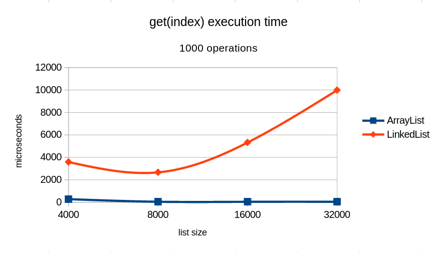
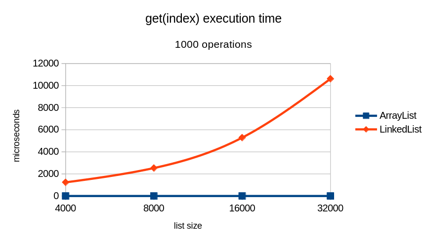

# Benchmarking data structures

The selection of appropriate data structures enables your programs to better
utilise available computing resources. The main characteristics of data
structures that affect their suitability for the particular project are
the *speed* of various operations with data structure and *memory size* used
store it. This document discusses the problems that arise when benchmarking
*Java* program code and presents the way to solve them.

Suppose our program needs dynamic one dimensional (and potentially large) list
of elements of the same  type and each element should be accessible by its
sequence number (i.e. index) as fast possible. The standard library of Java
has `java.util.ArrayList` and `java.util.LinkedList` classes that are well
suited for that purpose. Both of them implement method `get(int index)` and
we'd like to access the speed of its execution in given classes.

## Simple benchmark

Class `edu.ktu.ds.benchmark.SimpleBenchmark` provides the simplest implementation
of benchmark that measures execution time of `ArrayList.get()' and `LinmkedList.get()`
methods - i.e.,  which one of them is faster. Benchmarking code takes into account
these issues:

* In order to minimize the error of time measurements, the measured operation,
  `get()` method in our case, is executed many (e.g. 1000) times.
* Method is benchmarked using random indexes that are used to take elements from the list.
  This allow to obtain more generalised benchmark results. The lists are populated by
  random values as well, though that should bear no importance in our case, as `get()`
  method speed should not depend on data that is saved in the list.
* Utility operations that the benchmarked code can run without are removed as they
  influence benchmark results. In our case they constitute generation of random indexes.
  Even if those indexes wouldn't be reused for both benchmarked lists, the indexes should
  be  generated before measuring benchmark time. If "live" index generation is used
  (`list.get(generator.nextInt())`), the substantial amount of measured time (about half
  of it in our case) would be used for running random generator that is not directly related
  to `get()` operation.
* The speed of `get()` method is measured using lists of various size. The reason for
  that comes from theoretical background of benchmarked data structures that leads us
  to expect that operation runtime depends on list size (at least in case of `LinkedList`).
  If, as in given benchmark, the exact size of measured list is not known beforehand,
  they are freely chosen in oder to examine the runtime dependency of increased list size.

Unfortunately, the first implementation of list benchmark gives us results that are hard
to explain: when list size is increased from 4000 to 8000, method is executed even faster:

|       | ArrayList, us | LinkedList, us |
|------:|--------------:|---------------:|
|  4000 |   **276.495** |   **3582.875** |
|  8000 |        42.795 |       2661.929 |
| 16000 |        40.154 |       5321.878 |
| 32000 |        43.965 |       9986.685 |

## Improved benchmark

One can observe that excecution time that was measured at the start of benchmark
(with lists of 4000 elements) differs from other measurements. At the beginning
benchmarking tests run slower. Results that we get for list with  8000, 16000 and
32000 elements are consistent and echoes the theroy of data structures: time for
getting `ArrayList` element by index should be constant and not depend on list
size, while for `LinkedList` - proportional to lise size.

The inconsistency of benchmark results comes from code optimizations that are
performed by *Java* virtual machine. Optimizations are carried out at runtime and
usually are triggered after the particular number of code executions. Ir our case
optimization was performed roughly at the same time when list size is changed from
4000 to 8000 elements. One of possible solutions is to discard the results from
benchmarking lists with 4000 elements. Or, if `get()` method execution speed with
4000 element list is required, benchmark can be started with additional long lists
(e.g. 64000 element) that should trigger code optimizations and leave subsequent
results in more consistent state:

|       | ArrayList, us | LinkedList, us |
|------:|--------------:|---------------:|
| 64000 |   ~~329.833~~ |  ~~23623.892~~ |
|  4000 |        40.493 |       1423.931 |
|  8000 |        42.838 |       2683.397 |
| 16000 |        39.306 |       5241.339 |
| 32000 |        39.228 |      10302.222 |

## JMH benchmark

Improvements of "improved" benchmark that "warpup" *Java* virtual machine contain
extra code that would be necessary for all *Java* benchmarking implementations.
Even so, as we'll see further, such "manual" warmup does not guarantee that we'll
reach the same level of optimizations as long-running *Java* code. From programmer
perspective *Java* virtual machine works like a "black box" since it does not
provide any tools to control the process of runtime optimizations. That prompted
*Java* VM developers to create a tool to facilitate benchmarking *Java* code -  
*JHM* ([Java Microbenchmark Harness](https://openjdk.java.net/projects/code-tools/jmh/)).
It uses benchark annotations to generate supplementary *Java* code that enhances
reliability or benchmark results.

`JmhBenchmark` class provides *JMH* benchmarks for `ArrayList.get()` ir `LinkedList.get()`
methods. Benchmarks use the same logic as in `SimpleBenchmark`. *JMH* runs `@Benchmark`
annotated class methods and measures their execution time (the purpose of this and other
annotations are provided in code comments). *JMH* uses annotation for code generation,
thus changing annotation require project rebuild (e.g. "Build -> Rebuild Project" in
IntelliJ IDEA).

*JMH* benchmark results for `LinkedList.get()` are similar to the ones from before, but
`ArrayList.get()` execution time is around 100 times shorter:

|       | ArrayList, us | LinkedList, us |
|------:|--------------:|---------------:|
|  4000 |     **0.441** |       1236.023 |
|  8000 |     **0.442** |       2532.494 |
| 16000 |     **0.441** |       5286.967 |
| 32000 |     **0.442** |      10616.272 |

If we had increased execution count of `ArrayList.get()` in our previous benchmark,
we'd get similar execution times in all our benchmarks. One of the reasons is
insufficient "warmup" of *Java* virtual machine in both simple and improved
benchmarks, thus it's better to leave this function to JMH.

## Enhanced JMH benchmark

Upon examination of results from last benchmark, where `ArrayList.get()` performed
much faster than other methods, one can notice that benchmark implementation don't
use `get()` method return value. That leads to optimization that removes redundant
code. Benchmarks that intent to measure code execution time but are not concerned
about results of running that code need additional means to avoid such optimizations.
*JMH* has several ways to do that:

* The simplest approach is to return the calculation result from `@Benchmark` method.
* If we have more than one result, they can be combined to new value that is returned
  from `@Benchmark` method (e.g. a sum of two number can be calculated). This way is only
  applicable is combining results, relative to other calculations, is fast and does not
  distort benchmark results.
* The most universal way is to use *JMH* `Blackhole` abjects.

If we add `Blackhole` objects so our benchmarks and supply the elements we get from
`get()` method to these objects, `ArrayList.get()` execution time increases:

|       | ArrayList, us | LinkedList, us |
|------:|--------------:|---------------:|
|  4000 |     **5.277** |       1232.701 |
|  8000 |     **5.284** |       2484.535 |
| 16000 |     **5.314** |       5061.168 |
| 32000 |     **5.341** |       9990.668 |

It should be noted that such micro benchmarks use artificial environment to measure
code execution speed and in real life scenarios the same code can behave differently.
*JMH* tools only provide programmer with instruments to enhance the reliability
of micro benchmarks.